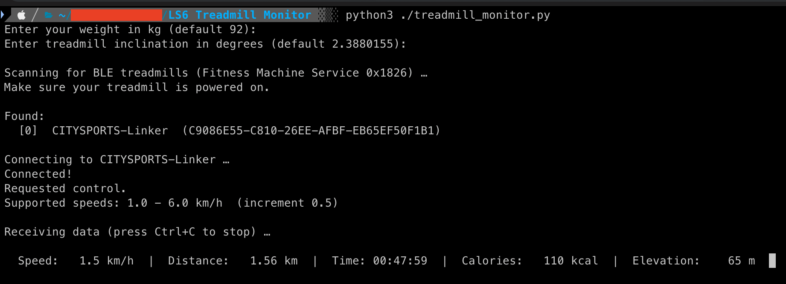

# LS6-Treadmill-Monitor

Скрипт подключается к беговой дорожке Citysports LS6 по Bluetooth (BLE) и в реальном времени
выводит в терминал оригинальные показатели (скорость, время, дистанция и т.д.) 
а также рассчитывает несколько дополнительных (расход калорий, набор высоты и т.д.).
Не мешает работе оригинального пульта.



## Требования

- Python 3
- [bleak](https://github.com/hbldh/bleak) -- библиотека для работы с BLE
- Включённый Bluetooth

## Установка и запуск

```bash
python3 -m venv .venv           # создать виртуальное окружение
source .venv/bin/activate       # активировать
pip install bleak               # установить зависимости
python3 ./treadmill_monitor.py    # запустить
```

1. Ввести свой вес
2. Ввести угол наклона беговой дорожки
3. Дождаться автоматического подключения к BLE-устройству и вывода показателей

По окончанию работы выйти из venv:
```bash
deactivate
```

## Как считаются калории

Текущая формула использует MET-значения для ходьбы по **ровной поверхности**:

| Скорость     | MET |
|--------------|-----|
| < 3.2 км/ч   | 2.5 |
| 3.2-4.0 км/ч | 3.0 |
| 4.0-5.6 км/ч | 3.5 |
| > 5.6 км/ч   | 4.0 |

Калории: `(MET - 1) * вес(кг) * время(ч)`

## TODO

- [x] **Расчет набора высоты по введённому углу наклона дорожки**
- [ ] **Расчет калорий с учетом набора высоты**

## Благодарности

За реверс Bluetooth-протокола беговых дорожек Citysports в проекте [FitnessMachine](https://github.com/hughesjs/FitnessMachine) благодарю [hughesjs](https://github.com/hughesjs) 

## Лицензия

[WTFPL](http://www.wtfpl.net/) -- Do What The Fuck You Want To Public License.
